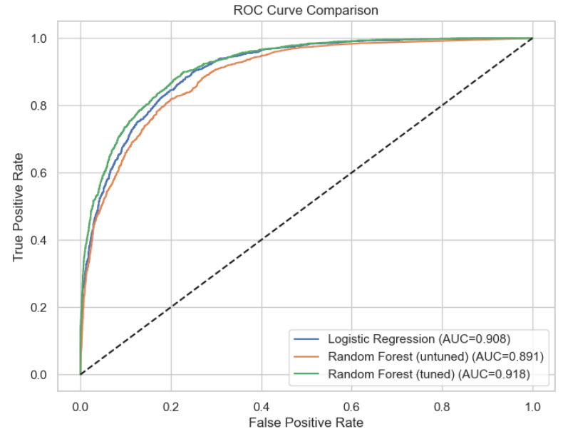
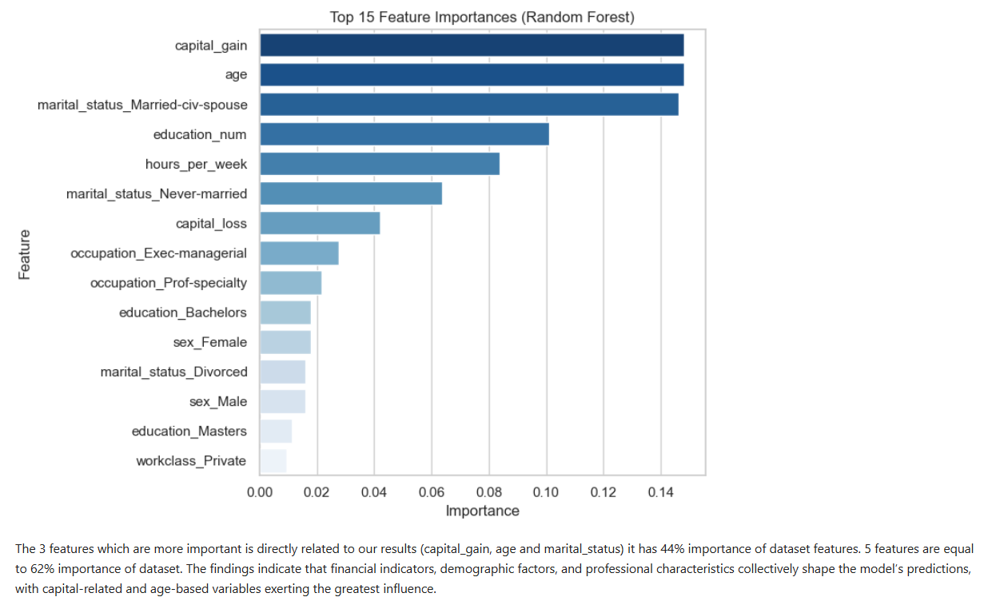

# 🤖 Applied Machine Learning — Income Prediction

## Overview

This project applies a complete machine learning workflow to the **UCI Adult Income dataset**, with the goal of predicting whether an individual's annual income exceeds $50K based on demographic, educational, and employment-related features.

The project covers data loading, cleaning, feature selection, preprocessing, model comparison, hyperparameter tuning, and model interpretation.

## 🎯 Objective

Build and compare classification models to predict whether an individual's income is:

- `<=50K`
- `>50K`

The final model was selected based on its performance across multiple classification metrics, with particular attention to ROC-AUC, precision, recall, and F1-score.

## 📊 Dataset

The project uses the **UCI Adult dataset**, containing information such as:

- Age
- Education
- Work class
- Occupation
- Marital status
- Sex
- Hours worked per week
- Capital gain and loss

The dataset contains **32,561 observations** and 15 original variables.

## 🔧 Workflow

The analysis follows a structured machine learning pipeline:

1. Load the dataset from the UCI repository
2. Inspect and clean the data
3. Select relevant numerical and categorical features
4. Split the data into training and test sets
5. Apply preprocessing using `StandardScaler` and `OneHotEncoder`
6. Train Logistic Regression and Random Forest models
7. Tune the Random Forest using `GridSearchCV`
8. Compare model performance
9. Analyze feature importance
10. Select the final model

## 🧠 Models

The project evaluates:

- Logistic Regression
- Random Forest
- Tuned Random Forest

The final model is a **tuned Random Forest classifier**.

## 📈 Model Performance

| Model | Accuracy | Precision | Recall | F1 | ROC-AUC |
|---|---:|---:|---:|---:|---:|
| Logistic Regression | 85.5% | 74.2% | 60.8% | 66.8% | 90.8% |
| Random Forest | 84.2% | 68.7% | 63.0% | 65.7% | 89.1% |
| **Tuned Random Forest** | **86.5%** | **76.5%** | **63.7%** | **69.5%** | **91.8%** |

The tuned Random Forest achieved the strongest overall performance, with an **ROC-AUC of 91.8%** and an **accuracy of 86.5%** on the test set.

## 📉 ROC Curve Comparison



The ROC curves show the performance of the three evaluated models. The tuned Random Forest achieved the highest ROC-AUC at **0.918**.

## 🔍 Feature Importance



The feature importance analysis highlights the variables that contributed most strongly to the Random Forest predictions.

The most influential features include:

- Capital gain
- Age
- Marital status
- Education level
- Hours worked per week

## 🔬 Data Preparation

The preprocessing pipeline separates numerical and categorical variables.

Numerical features are standardized using `StandardScaler`, while categorical variables are transformed using `OneHotEncoder`.

This preprocessing is integrated into the machine learning workflow using `ColumnTransformer` and `Pipeline`.

## 🛠️ Technologies

- Python
- Pandas
- NumPy
- Scikit-learn
- Matplotlib
- Jupyter Notebook

## 📁 Project Structure

```text
applied-machine-learning/
│
├── README.md
├── VitorLimaAppliedMachineLearning.ipynb
│
└── screenshots/
    ├── 01-data-loading.png
    ├── 02-data-cleaning.png
    ├── 03-feature-selection.png
    ├── 04-preprocessing-pipeline.png
    ├── 05-model-comparison.png
    ├── 06-roc-curve-comparison.png
    └── 07-feature-importance.png
