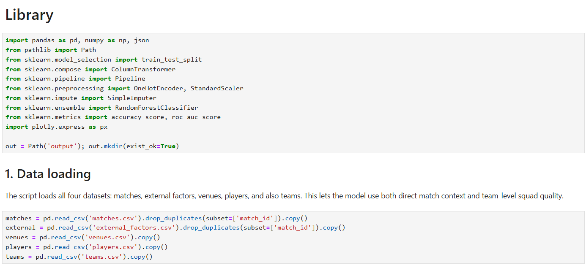
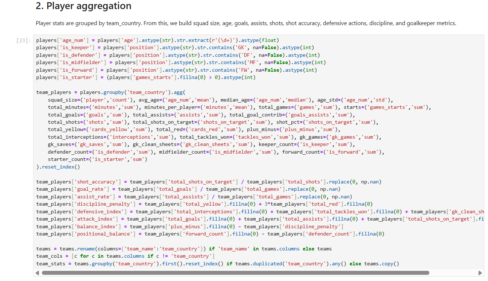
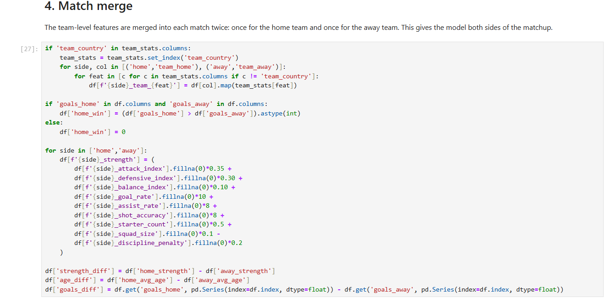
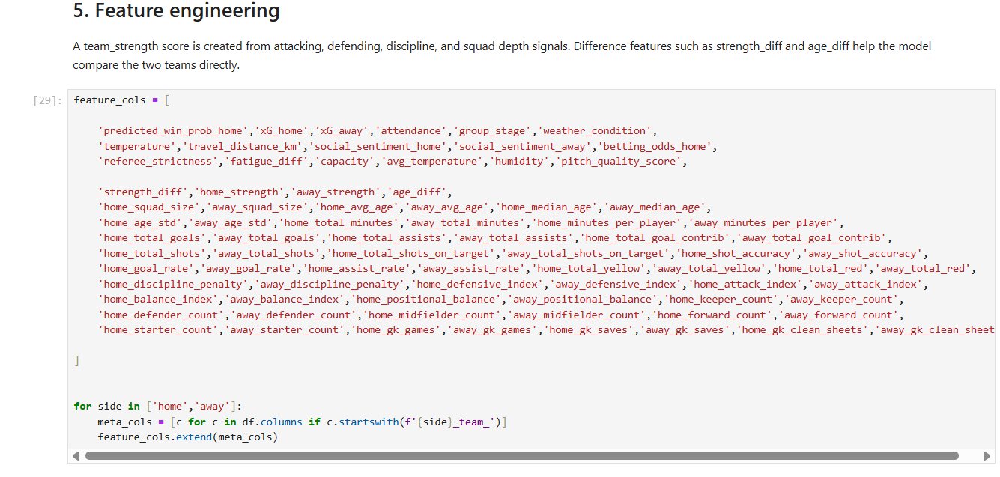
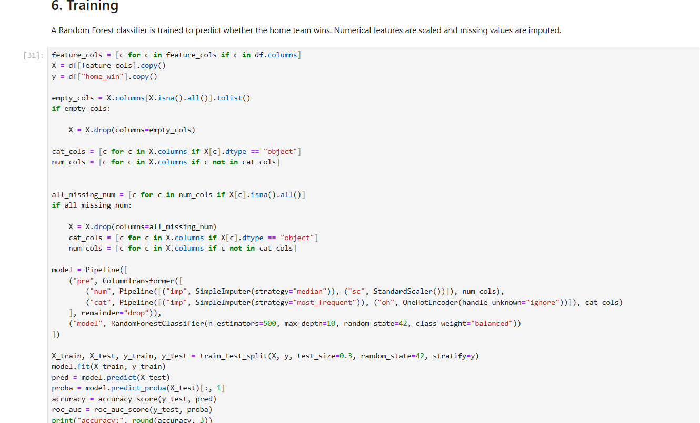
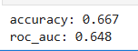
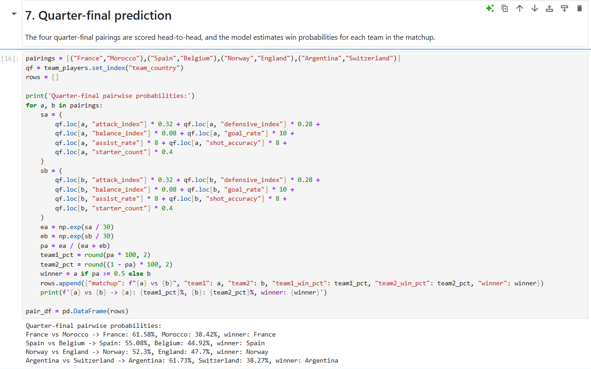

# ⚽ Football Match Outcome Prediction

## Overview

This project explores the use of machine learning to predict football match
outcomes using historical match, team, player and contextual data.

The project combines information from multiple datasets to construct
team-level features and estimate the probability of a team winning a matchup.

---

## 🎯 Objective

The objective is to develop a model that can estimate the probability of a
home team winning a football match.

The project includes:

- Data loading and preparation
- Player-level aggregation
- Team-level feature construction
- Dataset merging
- Feature engineering
- Machine learning model training
- Model evaluation
- Quarter-final prediction

---

## 📊 Data

The project combines several datasets containing information about:

- Matches
- Teams
- Players
- Venues
- External/contextual factors

### Data loading

The datasets are loaded and prepared before being combined for modelling.



---

## 👥 Player Aggregation

Player-level statistics are aggregated by team to create team-level
performance indicators.

These include statistics such as:

- Squad size
- Average and median player age
- Minutes played
- Goals
- Assists
- Shots
- Shot accuracy
- Discipline
- Defensive actions
- Goalkeeper statistics



---

## 🔗 Match and Team Data Integration

Team-level information is merged into the match dataset for both the home
and away teams.

This allows the model to compare the characteristics of both sides of
each matchup.



---

## 🛠️ Feature Engineering

Several derived features are created to represent team strength and the
difference between competing teams.

Examples include:

- `strength_diff`
- `age_diff`
- `goal_rate`
- `assist_rate`
- `shot_accuracy`
- `discipline_penalty`
- `defensive_index`
- `attack_index`
- `balance_index`
- `positional_balance`



---

## 🤖 Model Training

A Random Forest classifier is trained to predict whether the home team wins.

The modelling pipeline includes:

- Missing-value imputation
- Numerical feature scaling
- Categorical feature encoding
- Random Forest classification

The preprocessing and model are combined using a scikit-learn `Pipeline`
and `ColumnTransformer`.



---

## 📈 Model Performance

The model achieved the following results on the evaluation dataset:

| Metric | Result |
|---|---:|
| Accuracy | 66.7% |
| ROC-AUC | 64.8% |



---

## 🏆 Quarter-final Predictions

The trained model is used to estimate win probabilities for four
quarter-final matchups.



The predicted pairwise probabilities were:

| Matchup | Team 1 | Team 2 |
|---|---:|---:|
| France vs Morocco | 61.58% | 38.42% |
| Spain vs Belgium | 55.08% | 44.92% |
| Norway vs England | 52.30% | 47.70% |
| Argentina vs Switzerland | 61.73% | 38.27% |

The corresponding predicted winners were:

- France
- Spain
- Norway
- Argentina

The calculation behind these predictions is shown below.


---

## 🔄 Project Workflow

```text
Match Data
     +
Player Data
     +
Team Data
     +
Venue / External Data
          ↓
    Data Preparation
          ↓
   Player Aggregation
          ↓
 Team-Level Features
          ↓
     Match Merge
          ↓
   Feature Engineering
          ↓
    Random Forest
          ↓
    Model Evaluation
          ↓
 Quarter-final Predictions
