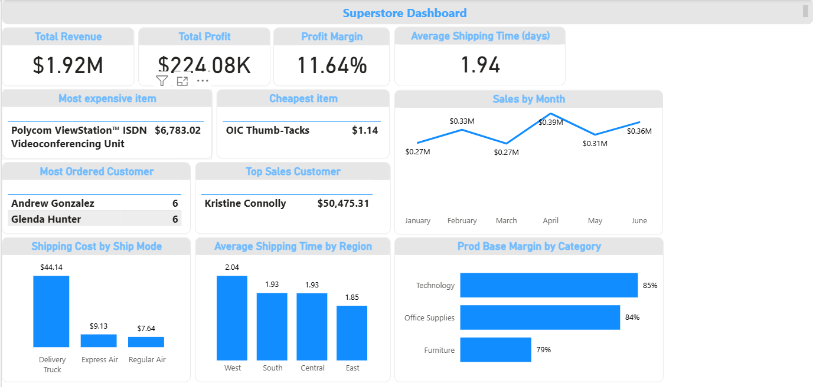
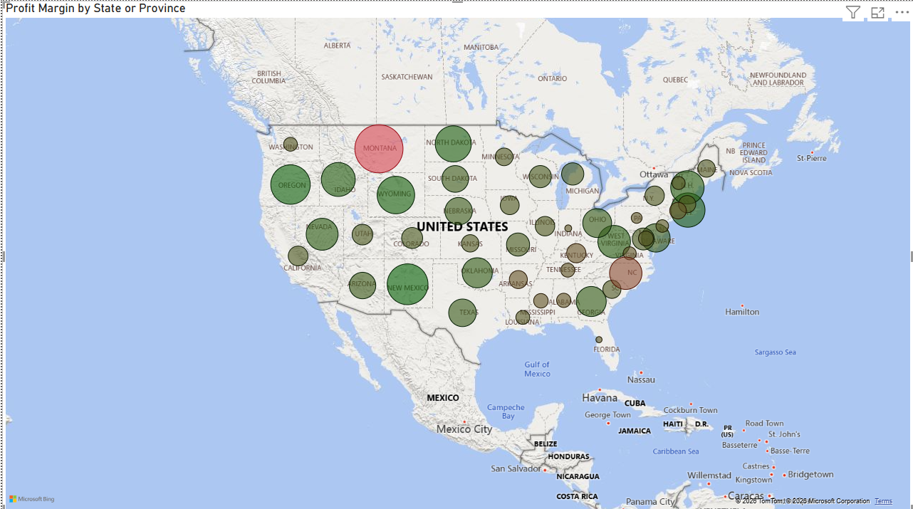
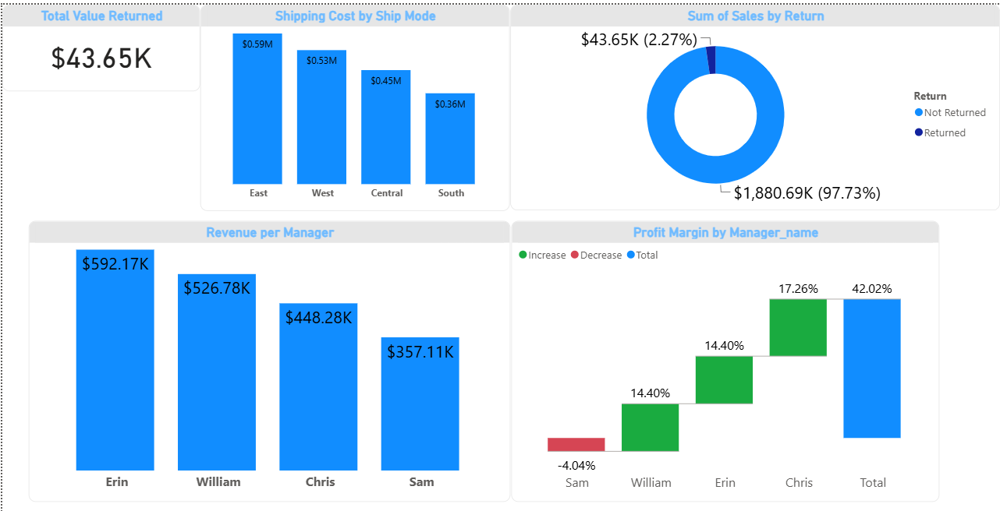
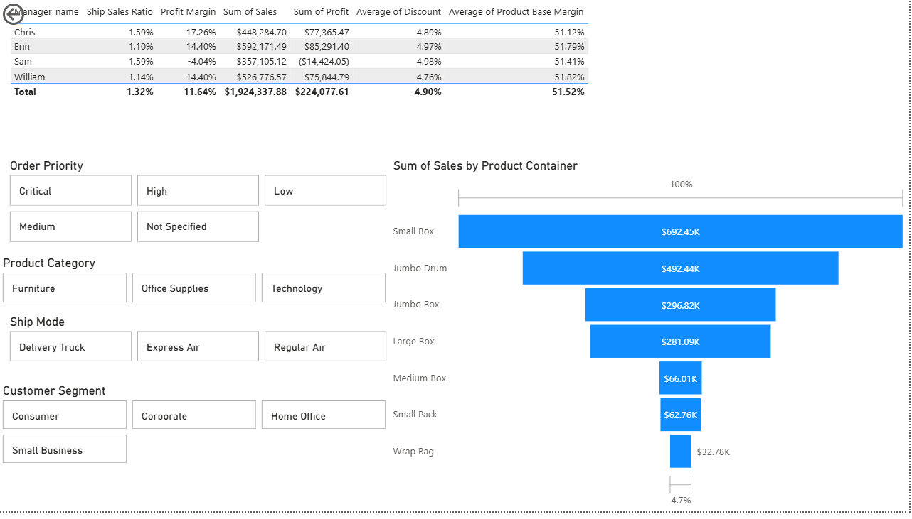

# 📊 Superstore — Power BI Business Intelligence Dashboard

## Overview

This project presents an interactive **Power BI dashboard** built to analyze sales, profitability, shipping performance, customers, returns, products, and regional performance using Superstore data.

The dashboard focuses on transforming business data into clear visual insights that can support decision-making across sales, operations, and management.

---

## 🎯 Project Objectives

The dashboard was designed to:

- Monitor overall revenue and profitability
- Analyze profit margins across regions and states
- Understand customer segment performance
- Evaluate shipping costs and shipping time
- Analyze product and category performance
- Track returned versus non-returned sales
- Compare manager performance
- Identify important business trends and patterns

---

## 📌 Key Business Metrics

The main dashboard reports:

| Metric | Result |
|---|---:|
| Total Revenue | **$1.92M** |
| Total Profit | **$224.08K** |
| Profit Margin | **11.64%** |
| Average Shipping Time | **1.94 days** |
| Shipment Cost to Sales Ratio | **1.32%** |
| Returned Sales | **$43.65K (2.27%)** |

---

## 📈 Dashboard Analysis

### 1. Main Dashboard

The main dashboard provides an overview of the business, including:

- Revenue
- Profit
- Profit margin
- Average shipping time
- Monthly sales
- Top customers
- Shipping costs by ship mode
- Regional shipping performance
- Product category performance

---

### 2. Profit Margin by State

This view uses geographic visualization to examine **profit margin by state or province**.

It helps identify regional differences in profitability and provides a geographic perspective on business performance.

---

### 3. Returns & Manager Performance

This dashboard section combines return analysis with manager performance.

Key areas include:

- Total returned value
- Returned versus non-returned sales
- Revenue by manager
- Profit margin by manager
- Sales and profit by manager
- Shipping cost ratios
- Average discount
- Average product base margin

The manager analysis highlights differences in sales contribution and profitability across the management team.

---

### 4. Product Sales Analysis

This view analyzes sales performance across product containers and provides interactive filtering by business dimensions.

The dashboard includes product-level and category-level analysis that can be used to explore differences in sales performance.

---

## 🔎 Key Insights

Several notable observations from the dashboard include:

- The business generated approximately **$1.92M in revenue** and **$224K in profit**.
- Overall profit margin was approximately **11.64%**.
- **Technology** had the highest product base margin among the three major categories shown.
- Returned sales represented approximately **2.27%** of total sales.
- **Erin** generated the highest revenue among the managers at approximately **$592K**.
- **Chris** recorded the highest manager-level profit
